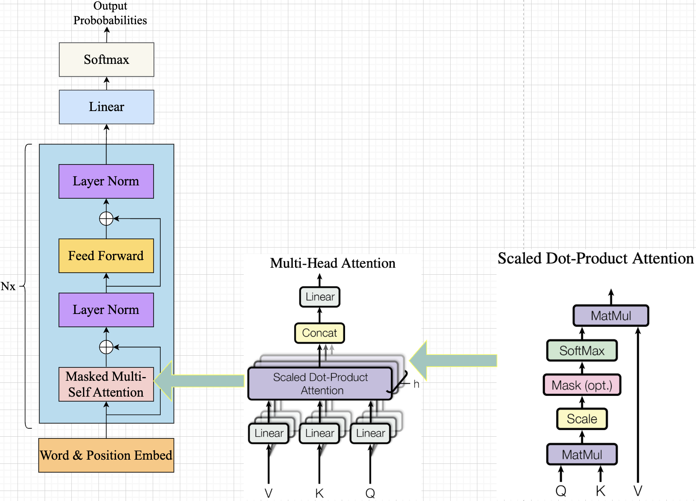
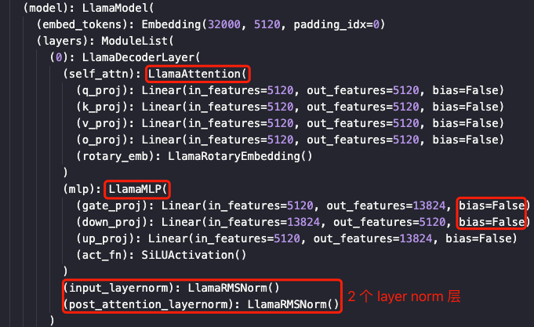

- [一，decoder-only 架构](#一decoder-only-架构)
	- [1.1，decoder-only 模型结构](#11decoder-only-模型结构)
	- [1.2，llama 模型配置文件解析](#12llama-模型配置文件解析)
	- [1.3，子 layer 输入输出分析](#13子-layer-输入输出分析)
- [二，参数量 Params 理论分析](#二参数量-params-理论分析)
	- [2.1，Embedding 层参数量](#21embedding-层参数量)
	- [2.2，Multi-Head Attention (MHA) 层参数量](#22multi-head-attention-mha-层参数量)
	- [2.3，Add \& Norm 层参数量](#23add--norm-层参数量)
	- [2.4，FeedForward Layer (FFN)/MLP 层参数量](#24feedforward-layer-ffnmlp-层参数量)
	- [2.5，总的公式](#25总的公式)
- [三，内存使用量理论分析](#三内存使用量理论分析)
- [四，计算量 FLOPs 理论分析](#四计算量-flops-理论分析)
	- [4.1，MHA 层计算量](#41mha-层计算量)
	- [4.2，FFN 层计算量](#42ffn-层计算量)
	- [4.3，其他操作的计算量。](#43其他操作的计算量)
	- [4.4，总的计算量](#44总的计算量)
	- [4.5，计算量 FLOPs 的定性和定量结论](#45计算量-flops-的定性和定量结论)
- [参考资料](#参考资料)

## 一，decoder-only 架构

**本文分析的是采用 `decoder-only` 框架的 `LLM`（如 `llama` 和 `gpt` 系列的大语言模型）的参数量 `params`、计算量 `FLOPs`、理论所需 `CPU` 内存和 `GPU` 显存**。

`Decoder-only` 只使用 `Transformer` 模型中的解码器（Decoder）部分，而不是完整的编码器-解码器（Encoder-Decoder）架构，主要特点是**自回归生成和掩码机制（Causal Masking）**。

以 llama/gpt1-3 系列模型分析 `decoder-only` 模型结构，模型的 `decoder` 结构与原始的相比，去掉了 Encoder-Decoder attention（Decoder 中的第二个 attention），**只保留了 `Masked Self-Attention`**。

一个正常的 `Attention` 允许一个位置关注/看见到它两边的 `tokens`，而 `Masked Attention` 只让模型看到左边的 `tokens`：


> 图： self attention vs mask self attention

### 1.1，decoder-only 模型结构

以 `gpt1-3` 模型为例，`decoder-only` 架构的 `transformer` 模型结构如下所示:


> llama、gpt 或者其他 decoder-only 架构的模型，在细节上会有所区别，但是主要网络层不会变。

可以看出，模型由 $N$ 个相同的 `decoder block` 串联而成，每个 `decoder block` 又由一个带掩码（`mask`）多头注意力（MHA）层、2 个层归一化层、和一个前馈神经网络（FFN）层组成：

```bash
(masked)multi_headed_attention --> layer_normalization --> MLP -->layer_normalization
```

### 1.2，llama 模型配置文件解析

在计算模型参数量/计算量之前，我们需要先定义好一些表示符号：

- `batch_size`：批量大小。
- `seq_len`：序列长度，即输入 `prompt` 字符串的长度。
- `d_model`: 序列中每个 `token` 的 `embedding` 向量的维度（隐藏层的维度）。**它定义了输入和输出的特征向量的大小，也是模型内部各个组件（特别是注意力机制和前馈网络）操作的主要向量维度**。
- `vocab_size`：词表大小。也是每个 token 在做 embedding 前的 one-hot 向量维度。
- `n_layers`：模型中 decoder layers 层数，对应 hf 模型配置文件中的 num_hidden_layers。

这些变量值都可以在模型配置文件中找到，以 `llama-13b` 模型配置文件为例，主要字段解释如下：


- `vocab_size`：词汇表中标记的数量，也是嵌入矩阵的第一个维度。
- `hidden_​​size`：模型的隐藏层大小，其实就是 $d_\text{model}$。
- `num_attention_heads`：模型的多头注意力层中使用的**注意力头数量**。
- `num_hidden_layers`：模型中的块数（层数）, number of layers。
- `max_sequence_length`: $2048$, 即代表预训练的 LLaMA 模型的最大 Context Window 只有 $2048$。

### 1.3，子 layer 输入输出分析

对于每个 `token`，各个 layer 的参数量分析过程如下所示:

1，，`Masked Multi-Head Attention` 层的输入是 `Embedding Vector`，形状为 $[1, \text{d\_model}]$。**`Embedding Vector` 经过 `3` 个线性层的线性变换（`Linear` 层）分别得到 $Q$、$K$、$V$ 三个向量**，并将它们作为 `Scale Dot Product Attention` 层的输入。多个 `Scale Dot Product Attention` 层的输出进行 `concat` 后，**再经过 `1` 个线性层进行维度的映射，得到最终的输出**。
> 对于每一个 `token`，都会生成三个向量 $q$、$k$、$v$，向量大小为 $\text{d\_model}$；对于长度为 `seq_len` 的输入序列，则生成三个矩阵 $Q$、$K$、$V$，形状为 $[\text{seq\_len}, \text{d\_model}]$。

`Scale Dot Product Attention` 层的内部计算过程用数学公式可表达为:

$$\text{Attention}(Q, K, V) = \text{softmax} (\frac{QK^T}{\sqrt{d_k}})V$$

以上分析可以得出: **`Masked Multi-Head Attention` 层的权重参数包括 $Q$、$K$、$V$ 的权重矩阵 $W_Q$、$W_K$、$W_V$ 及其偏置，以及输出权重矩阵 $W_O$**，这些权重矩阵的大小都是 $[\text{d}_\text{model}, \text{d}_\text{model}]$。

另外，`concat` 算子无参数，`Scale Dot Product Attention` 层都是计算 Kernel，内部执行的操作也不涉及权重参数。

2，`Add & Norm` 层由 `Add` 和 `Norm` 两部分组成。这里的 Add 指 X + MultiHeadAttention(X)，是一种残差连接。Norm 是 Layer Normalization。Add & Norm 层计算过程用数学公式可表达为:

$$\text{Layer Norm}(X + \text{MultiHeadAttention}(X))$$

Add 比较简单，执行的是逐元素相加操作，该算子没有参数。

3，Feed Forward 层全称是 Position-wise Feed-Forward Networks（`FFN`），其本质是一个**两层的全连接层**（线性层），第一层的激活函数为 `Relu`，第二层不使用激活函数，计算过程用数学公式可表达为：

$$\text{FFN}(X) = \text{max}(0, XW_1 + b_1 )W_2 + b_2$$

一般地，第一个线性层是先将维度从 $\text{d\_{model}}$ 映射到 $\text{4d\_{model}}$，第二个线性层再将维度从 $\text{4d\_{model}}$ 映射到 $\text{d\_{model}}$。FFN 层由 2 个参数权重矩阵组成，权重矩阵形状: $W_1:   [\text{d}_\text{model}, 4\text{d}_\text{model}]$，权重 $W_2: [4\text{d}_\text{model}, \text{d}_\text{model}]$。

4，另外，最底层的 `decoder layer` 的输入是 `Embedding` 层（Token Embedding + Positional Embedding），其他 decoder layer 的输入是上一层的输出。  

模型总的参数量计算公式可抽象如下:

$$\text{totoal param} = \text{param}_{\text{embedding}} + \text{param}_\text{decoder layer} \cdot \text{n}_\text{layers}$$

注意，很多 `decoder-only` 架构的自回归模型的全连接层的偏置 `bias` 都设置为 False，故这里的计算公式中没有考虑偏置参数。



## 二，参数量 Params 理论分析

### 2.1，Embedding 层参数量

`Embedding` 层包括两部分: Token Embedding (`TE`) 和 Positional Embedding (`PE`)。

1，Token Embedding (TE)

Token Embedding 层的参数量较多，需要计算。输入 token 序列的维度是 `[batch_size, seq_len, vocab_size]`（后续都统一把输入维度写前，输出维度写后），其经过 `Token Embedding` 层后的输出维度是 `[batch_size, seq_len, d_model]`。对应 Token Embedding 层权重矩阵的大小为：`[vocab_size, d_model]`，因此 **`Token Embedding` 层的参数量为**：

$$\text{param}_\text{TE} = \text{vocab\_size} \cdot \text{d}_\text{model}$$

2，Positional Embedding (PE)

位置 Embedding 层的参数量比较小，有时可忽略不计。

### 2.2，Multi-Head Attention (MHA) 层参数量

这里不单独计算每个 self-attention 层的参数量了，毕竟实际代码中，其都是在一个矩阵中。MHA 层的参数有 $Q$、$K$、$V$ 的权重矩阵 $W_Q$、$W_K$、$W_V$ 及其偏置，以及输出映射层的权重矩阵 $W_O$ 和偏置，这些权重矩阵的大小都是 $[\text{d}_\text{model}, \text{d}_\text{model}]$。

故，(MHA) 层参数量为:

$$\begin{align} 
\text{param}_\text{MHA} 
&= \text{param}_\text{Q} + \text{param}_\text{K} + \text{param}_\text{V} + \text{param}_\text{output} \nonumber \\
&= \text{d}_\text{model}\cdot \text{d}_\text{model} + \text{d}_\text{model}\cdot \text{d}_\text{model} + \text{d}_\text{model}\cdot \text{d}_\text{model} + \text{d}_\text{model}\cdot \text{d}_\text{model} \nonumber \\
&= 4\cdot {\text{d}_\text{model}}^{2} \nonumber
\end{align}$$

### 2.3，Add & Norm 层参数量

`Add & Norm` 层由 Add 和 Norm 两部分组成。这里的 Add 指 X + MultiHeadAttention(X)，是一种残差连接。Norm 是 Layer Normalization。Add & Norm 层计算过程用数学公式可表达为:

$$\text{Layer Norm}(X + \text{MultiHeadAttention}(X))$$

Add 比较简单，执行的是逐元素相加操作，该算子没有参数。重点讲下 Layer Norm 层。Layer Norm 是一种常用的神经网络归一化技术，可以使得模型训练更加稳定，收敛更快。它的主要作用是对每个样本**在特征维度上进行归一化**，减少了不同特征之间的依赖关系，提高了模型的泛化能力。Layer Norm 层的计算可视化如下图所示:


从上图可以看出，layer norm 层主要有两个参数: $\mu_{\beta}$ 和 $\sigma_{\beta}$（scale factor and offset），这两个参数的大小都是 $[\text{d}_\text{model}]$，因此一个 `Layer Norm` 层的参数量为:

$$\text{param}_\text{LN} = (\text{d}_\text{model} + \text{d}_\text{model})$$

又因为 `MHA` 块和 `FFN` 块各有一个 `layer normalization` 层，故每个 decoder layer 中的总的 Layer Norm 参数量为:

$$\text{param}_\text{LN} = 2\cdot(\text{d}_\text{model} + \text{d}_\text{model}) = 4\cdot \text{d}_\text{model}$$

### 2.4，FeedForward Layer (FFN)/MLP 层参数量

FFN 层由 2 个参数权重矩阵组成：MLP Expansion 和 MLP Contraction，其大小分别是 

- 权重 $W_1 \in [\text{d}_\text{model}, 4\text{d}_\text{model}]$
- 权重 $W_2 \in [4\text{d}_\text{model}, \text{d}_\text{model}]$

因此，FFN 层的参数量为:

$$\begin{align} 
\text{param}_\text{FFN} &= \text{param}_\text{fc1} +  \text{param}_\text{fc2} \nonumber \\
&= \text{d}_\text{model} \cdot 4\text{d}_\text{model} + 4\text{d}_\text{model}\cdot\text{d}_\text{model} \nonumber \\
&= 8\cdot {\text{d}_\text{model}}^{2} \nonumber
\end{align}$$

### 2.5，总的公式

1，**单个 `decoder Layer` 参数量**:

$$\begin{align} 
\text{param}_\text{decoder\_layer} 
&= \text{param}_\text{MHA}  + \text{param}_\text{LN} + \text{param}_\text{FFN} \nonumber \\
&= 4\cdot {\text{d}_\text{model}}^{2} + 4\cdot \text{d}_\text{model} + 8\cdot {\text{d}_\text{model}}^{2} \nonumber \\
&= 12\cdot {\text{d}_\text{model}}^{2} + 4\cdot \text{d}_\text{model} \nonumber
\end{align}$$

2，**模型总的参数量计算公式**:

$$\begin{align}
\text{param}_\text{decoder-only-model} 
&= \text{param}_\text{TE} + \text{param}_\text{decoder layer} \cdot \text{n}_\text{layers} \nonumber \\
&= (12\cdot {\text{d}_\text{model}}^{2} + 4\cdot \text{d}_\text{model}) \cdot \text{n}_\text{layers} + \text{vocab\_size} \cdot \text{d}_\text{model} \nonumber \\
\end{align}$$

如果用 $h$ 代替 $\text{d}_\text{model}$，$n$ 代替 $\text{n}_\text{layers}$，$V$ 代替 $\text{vocab\_size}$，则**自回归模型的总参数量计算公式如下**:

$$n(12h^2 + 4h) + Vh $$

1. **参数量和输入序列长度无关**！
2. 因为大部分时候 $h>>n$，所以**模型参数量** $\cong 12nh^2$。
  
  不同版本 `LLaMA` 模型的参数量估算如下：

| 实际参数量 | 隐藏维度 h | 层数 n | heads 数目| 预估参数量 12nh^2 |
| :--------: | :--------: | :----: | ------- | :---------------: |
|    6.7B    |    4096    |   32   | 32      |   6,442,450,944   |
|   13.0B    |    5120    |   40   | 40      |  12,582,912,000   |
|   32.5B    |    6656    |   60   | 52      |  31,897,681,920   |
|   65.2B    |    8192    |   80   | 64      |  64,424,509,440   |

> 该章节主要参考资料 [Transformer Deep Dive: Parameter Counting](https://orenleung.com/transformer-parameter-counting)

另外，推特上有人研究了 `gpt-like` 模型（`opt`）的参数分布，下面是不同大小模型的一些图。可以看出，随着模型变大，`MLP` 和 `Attention` 层参数量占比越来越大，最后分别接近 `66%` 和 `33%`。这个比例可以通过上面的公式推测出来，估算公式:

$$8nh^2/12nh^2 = 2/3\cong 66\% \\
4nh^2/12nh^2 = 1/3\cong 33\%$$


## 三，内存使用量理论分析

1，模型参数内存如何计算？

- 对 int8 而言，模型参数内存 = 参数量 *（1字节/参数），单位字节数
- 对 fp16 和 bf16 而言，模型参数内存 = 参数量 *（2 字节/参数）

2，模型推理需要的总内存是多少？

推理总内存 ≈ 1.2 × 模型参数内存（20% 是经验，不同框架可能不一样）

## 四，计算量 FLOPs 理论分析

`FLOPs`：floating point operations 指的是浮点运算次数，**理解为计算量**，可以用来衡量算法/模型时间的复杂度。

全连接层的 FLOPs 计算：假设 $I$ 是输入层的维度，$O$ 是输出层的维度，对应全连接层（线性层）的权重参数矩阵维度为 $[I, O]$。

- 不考虑 bias，全连接层的 $FLOPs = (I + I -1) \times O = (2I − 1)O$
- 考虑 bias，全连接层的 $FLOPs = (I + I -1) \times O + O = (2\times I)\times O$

对于矩阵 $A\in\mathbb{R}^{1\times n}$，$B \in \mathbb{R}^{n\times 1}$，计算 $A\times B$ 需要进行 n 次乘法运算和 n 次加法运算，共计 2n 次浮点数运算，矩阵乘法操作对应的 FLOPs 为 $2n$。

**对于 $A \in \mathbb{R}^{m\times n}$，$B\in\mathbb{R}^{n\times p}$，执行矩阵乘法操作 $A\times B$，对应 `FLOPs` 为 $2mnp$**。

对于 transformer 模型来说，其计算量**主要**来自 `MHA` 层和 `FFN` 层中的矩阵乘法运算。先考虑 `batch_size = 1` 和 输入序列长度为 $s$ 的情况。

### 4.1，MHA 层计算量

先分析 `MHA` 块的计算量：

1, **计算 Q、K、V**：对输入的 Query (Q)、Key (K)、Value (V) 向量做线性变换，输入矩阵 $x$ 的形状为 $[s, h]$，做线性变换的权重矩阵 $W_Q$、$W_K$、$W_V$ $\in \mathbb{R}^{h\times h}$，矩阵乘法的输入和输出形状为: $[s,h] \times [h,h]\to [s,h]$，`FLOPs`: $3* 2sh^2 = 6sh^2$。

2, **Self-Attention 层**，`MHA` 包含 `heads` 数目的 `Self-Attention` 层，这里直接分析所有 `Self-Attention` 层的 `FLOPs`:
- **$QK^T$ 打分计算**：每个头需要计算 Query 和 Key 的点积，所有头的 $QK^T$ 矩阵乘法的输入和输出形状为: $[s,h] \times [h,s]\to [s,s]$，`FLOPs`: $2s^2h$。
- **应用注意力权重**：计算在 $V$ 上的加权 $score\cdot V$，矩阵乘法的输入输出形状: $[s,s] \times [s,h]\to [s,h]$，`FLOPs`: $2s^2h$。

**`Scale Dot Product Attention` 层内部只估算两个矩阵乘法的计算量**，`attention_scale`（$/\sqrt(k)$）、`attn_softmax` ($\text{softmax}$) 的计算量忽略不计，因为这两个小算子都是逐元素操作。

3, **多头拼接和线性映射**：所有注意力头输出拼接后通过线性映射，`concat` 不涉及数学运算，只涉及内存操作。矩阵乘法的输入和输出形状为: $[s,h] \times [h,h]\to [s,h]$，**attention 后的线性映射的 `FLOPs`: $2sh^2$**。

### 4.2，FFN 层计算量

`Feed-forward`（MLP/FFN）层的计算量分析。包含两个线性层，以及一个 `relu` 激活层（逐元素操作，flops 很小$=5\cdot 4h$，可忽略）。`MLP` 两个线性层的权重参数矩阵: $W_1 \in \mathbb{R}^{h\times 4h}$、$W_2 \in \mathbb{R}^{4h\times h}$，`MLP` 的输入矩阵: $\in \mathbb{R}^{s\times h}$。


1. 第一个线性层，矩阵乘法的输入和输出形状为 $[s,h] \times [h,4h]\to[s,4h]$，`FLOPs` 为 $8sh^2$
2. 第二个线性层，矩阵乘法的输入和输出形状为 矩阵乘法的输入和输出形状为 $[s,4h] \times [4h, h]\to [s,h]$，`FLOPs` 为 $8sh^2$

因此，`FFN` 层的 `FLOPs`: $2*8sh^2 = 16sh^2$

### 4.3，其他操作的计算量。

1，`Embedding` 层只是一个查找表，没有进行显式的乘法运算，因此严格来说，Embedding 层本身不会产生 `FLOPs`，但可以通过其输出维度来推导其他层的 `FLOPs`。

2，`LayerNorm` 操作是**逐元素**进行的，因此不存在通用的公式来。`LayerNorm` 层的两个权重都是一个长度为 $h$ 的向量，`FLOPs` 可以预估为: $2h$，但**通常忽略不计**。

3，最后，另一个计算量的大头是 `logits` 的计算，**将隐藏向量映射为词表大小**。线性层的权重矩阵为：$W_{last} \in \mathbb{R}^{h\times V}$，矩阵乘法的输入和输出形状为: $[s, h] \times [h, V] -> [s, V]$。`FLOPs`: $2shV$。

### 4.4，总的计算量

将前面分析的计算量相加，得到每个 `decoder block/layer` 的计算量大约为: $(6sh^2 + 2sh^2 + 16sh^2) + 4hs^2 = 24sh^2 + 4s^2h$

**最后**，对于一个 $n$ 层的自回归模型，输入数据形状为 $[b, s]$ 的情况下，**一次训练/推理迭代的计算量**:

$$n\times (24bsh^2 + 4bs^2h) + 2bshV$$
> 忽略了向量-向量（甚至向量-标量）运算，这些运算的因子是 $h$ 远小于 $h^2$，因此可以忽略。

### 4.5，计算量 FLOPs 的定性和定量结论

**当隐藏维度 $h$ 比较大，且远大于序列长度 $s$ 时，则可以忽略一次项，计算量可以近似为 $24nbsh^2$，模型参数量为 $12nh^2$**。

因为，输入的 `tokens` 总数为 $bs$（即上下文总长度），即对于一个 `token` 存在等式: $\frac{24nh^2}{12nh^2} = 2$。所以，我们可以近似认为：**在一次前向传播中，对于每个 `token`，每个模型参数，需要进行 $2$ 次浮点数运算，即一次乘法法运算和一次加法运算**。
> 实际会有不到 `2%` 的误差，主要是因为我们忽略了一些小算子的计算量。

一次迭代训练包含了前向传递和后向传递，后向传递的计算量是前向传递的 `2` 倍。因此，前向传递 + 后向传递的系数 $=1 + 2 = 3$ 。**即一次迭代训练中，对于每个 token，每个模型参数，需要进行 $6$ 次浮点数运算**。

有了上述训练和推理过程中计算量与参数量关系的结论。接下来，我们就可以估计一次迭代训练 `GPT3-13B` 所需要的计算量。对于 GPT3，每个 token，每个参数进行了 $6$ 次浮点数运算，再乘以参数量和总 `tokens`数就得到了总的计算量。GPT3 的模型参数量为 12850M，训练数据量 300B tokens。

$$6 \times 12850 \times 10^6 \times 300 \times 10^9 = 2.313 \times 10^{22}$$

计算结果和下表所示结果相符合。


> 估算训练一个 transformer 模型所需的算力成本的公式可参考文章[Transformer 估算 101](https://mp.weixin.qq.com/s/MFgTUDAOODgMDb59eZC9Cw)。本章主要参考 [Transformer Inference Arithmetic](https://kipp.ly/blog/transformer-inference-arithmetic/) 以及 [分析transformer模型的参数量、计算量、中间激活、KV cache](https://zhuanlan.zhihu.com/p/624740065)。

这个表总结了常见大型语言模型（LLM）的**参数数量、序列长度、批次大小、隐藏层大小、层数和每次前向推理的浮点操作数总量（FLOPs）**，`FLOPs` 以 T（万亿）为单位。
| Model           | Parameters | Sequence Length | Batch Size | Hidden Size | Number of Layers | FLOPs (per forward pass)         |
|-----------------|------------|-----------------|------------|-------------|------------------|----------------------------------|
| GPT-3 (175B)    | 175B       | 2048            | 8          | 12288       | 96               | ~7.0 × 10³ T FLOPs                |
| GPT-3 (13B)     | 13B        | 2048            | 8          | 4096        | 40               | ~4.4 × 10² T FLOPs                |
| BERT-Large      | 345M       | 512             | 8          | 1024        | 24               | ~2.4 × 10¹ T FLOPs                |
| T5-11B          | 11B        | 512             | 8          | 1024        | 24               | ~1.4 × 10² T FLOPs                |
| LLaMA-13B       | 13B        | 2048            | 8          | 4096        | 40               | ~4.4 × 10² T FLOPs                |
| PaLM-540B       | 540B       | 2048            | 8          | 16384       | 96               | ~6.7 × 10⁴ T FLOPs                |
| ChatGPT (GPT-4) | 175B       | 2048            | 8          | 12288       | 96               | ~7.0 × 10³ T FLOPs                |
## 参考资料

1. [The Illustrated Transformer](http://jalammar.github.io/illustrated-transformer/)
2. [The Illustrated GPT-2 (Visualizing Transformer Language Models)](http://jalammar.github.io/illustrated-gpt2/)
3. [如何生成文本: 通过 Transformers 用不同的解码方法生成文本](https://huggingface.co/blog/zh/how-to-generate)
4. [分析transformer模型的参数量、计算量、中间激活、KV cache](https://zhuanlan.zhihu.com/p/624740065)