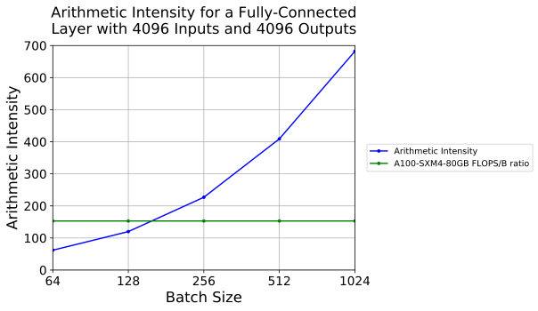

- [一 Roofline 性能分析模型](#一-roofline-性能分析模型)
  - [1.1 Roofline 模型原理](#11-roofline-模型原理)
  - [1.2 Roofline 模型实例分析](#12-roofline-模型实例分析)
  - [1.3 AI 应用性能优化策略](#13-ai-应用性能优化策略)
- [二 估算推理 latency](#二-估算推理-latency)
  - [2.1 推理 Latency 估算公式](#21-推理-latency-估算公式)
  - [2.2 数学（算力 FLOPS）带宽 vs 内存带宽](#22-数学算力-flops带宽-vs-内存带宽)
  - [2.3 LLM 并发支持估算](#23-llm-并发支持估算)
- [参考资料:](#参考资料)

## 一 Roofline 性能分析模型

### 1.1 Roofline 模型原理

`Roofline` 性能分析模型是一种用于**衡量和分析计算性能**的工具，它结合了计算性能和内存带宽的限制，帮助程序员识别性能瓶颈并优化代码。

Roofline 模型的核心概念是将应用程序的计算性能与硬件的理论峰值性能进行对比，**以揭示应用是受到计算性能的限制还是受到内存带宽的限制**。

Roofline 模型的两个关键指标：**操作强度** （Operational Intensity, OI， 也称算术强度 Arithmetic Intensity(AI)）和 **性能上限**Performance Boundaries）。

1, 操作强度：每访问一个字节的内存所执行的计算量（FLOPs/Byte）。

$$\text{OI} = \frac{\text{总浮点操作数（FLOPs）}}{\text{总内存访问量（Bytes）}}$$

2, 性能上限：
- 内存带宽上限：受限于内存传输带宽。
- 计算能力上限：受限于处理器的计算性能（例如每秒执行的 FLOPs 数量）。

`Roofline` 模型通过绘制两个约束条件的曲线：

- 带宽受限区域：当操作强度较低时，性能受内存带宽限制。
- 计算受限区域：当操作强度较高时，性能接近处理器的计算能力极限。

`Roof-line` 划分出的两个瓶颈区域定义如下：

$$
P = \begin{cases} 
\beta \cdot I & \text{if } I < I_{\max} \text{ (Memory Bound: 内存瓶颈区域)} \\
\pi & \text{if } I \geqslant I_{\max} \text{ (Compute Bound: 计算瓶颈区域)}
\end{cases}
$$

通过上述图，我们可以看到应用程序是在内存受限还是计算受限的区域，进而进行有针对性的优化。

下表是 v100、a100、h100 卡的常用性能指标和 `FP16 Tensor` 算力的操作强度 `oi`:

| GPU  | 显存            | CUDA 核心数 | FP16 Tensor Core 浮点运算能力| FP32 浮点运算能力| 最大内存带宽 | Tensor 运算强度（OI） |
|------|-----------------|------------|--------------------------|--------------------------|--------------|-----------------------|
| V100-SXM | 16 GB           | 5120       | 125 TFLOPS                | 15.7 TFLOPS               | 900 GB/s      | 138 TOPS (FP16)         |
| A100-SXM | 40 GB / 80 GB   | 6912       | 312 TFLOPS                | 19.5 TFLOPS               | 2039 GB/s     | 153 TOPS (FP16)        |
| H100-SXM | 80 GB           | 8192       | 989 TFLOPS                | 60 TFLOPS                 | 3350 GB/s     | 295 TOPS (FP16)       |

### 1.2 Roofline 模型实例分析

分析并计算 LLaMA-13B 模型的 Roofline 性能。

**1，计算操作强度（OI）**：

$$\text{OI} = \frac{n\times (24bsh^2 + 4bs^2h) + 2bshV}{1.2*12nh^2 + 4nbh(s+o)} = 7563.29\ \text{FLOPs/Byte}$$

2，**Roofline 模型的理论限制（A100 卡）**：
- **内存带宽**：GPU 的内存带宽为 2039 GB/s。
- **理论计算能力**（FLOPs）：GPU 的理论 `FP16` 计算能力为 312 TFLOPs（$312 * 10^{12}$FLOPs）。

根据这些数据，绘制 Roofline 图可以显示性能的上限，并展示应用程序的瓶颈。

**3，Python 代码示例**:

我们可以用 `Python` 编写一个简单的脚本，计算矩阵乘法的操作强度，并估算性能。

```python
import numpy as np

# 定义 LLaMA-13B 模型的参数
h = 5120    # 隐藏层维度
b = 8       # 推理时的批大小
s = 1024    # 输入序列长度
o = 1024    # 输出序列长度
n = 40      # Transformer 层数
V = 32000   # 词表大小

# 1. 计算每层的 FLOPs, 总 FLOPs = 每层 FLOPs * 层数
total_flops = n * (24*b*s*h*h + 4*b*s*s*h) + 2*b*s*h*V
print(f"Total FLOPs for LLaMA-13B: {total_flops / 10**12:.2f} TFLOPs")


# 2. 总的显存占用量（=显存访问量？）, 2字节访问
total_memory_access = 1.2*12*n*h*h + 4*n*b*h*(s+o)  
print(f"Total memory access: {total_memory_access / 10**9:.2f} GB")

# 3. 计算操作强度（OI = FLOPs / Memory Access）
llama_oi = total_flops / total_memory_access
print(f"Operational Intensity (OI): {llama_oi:.2f} FLOPs/Byte")

# 4. 定义 A100-SXM3 硬件参数
peak_flops = 312 * 10**12  # 312 FP16 Tensor Core TFLOPs
memory_bandwidth = 2039 * 10**9  # 900 GB/s = 900 * 10^9 Bytes/s

# 计算 Roofline 中的两条线

oi_max = peak_flops / memory_bandwidth
# 带宽受限部分（FLOPs = OI * Memory Bandwidth）
bandwidth_bound_performance = oi_values * memory_bandwidth
# 计算受限部分（FLOPs = Peak FLOPs）
compute_bound_performance = np.full_like(oi_values, peak_flops)


```

该代码将输出矩阵乘法的操作强度以及带宽受限时的性能上限。通过比较实际的性能和理论峰值性能，我们可以判断该应用是否是计算受限还是内存受限。

### 1.3 AI 应用性能优化策略


总结：
1. AI 应用的推理时间取决于多个因素，我们应该关注主要因素，比如：内存读写和数学计算时间，而不是次要因素：网络带宽和磁盘读写时间。
2. `Roofline Model` 有两个区域：**内存带宽受限**和**算力受限**区域，分别对应两种不同的优化策略。网络层/模型的算术强度 < GPU 的 `ops:byte ratio`，即内存带宽限制；反之，则是模型算力 FLOPS 限制。
3. AI 模型的推理时间取决于**内存读取时间**和 CPU/GPU **数学（乘加）计算时间**，取决于哪个时间更长。一般来讲，当处于**内存受限**时，内存读取时间长；当处于**算力受限**时，数学计算时间长。

以 A100 GPU 为例，该硬件的 ops:byte ratio 是 $208$（V100 是 $138.9$），这意味着如果我们计算一个 token 的 `kv` 值，与计算多达 `208` 个 token 的时间几乎是相同的！因为低于这个数，会受到内存带宽的限制，且内存时间 > 数学计算时间；高于这个数，我们会受到算力 `FLOPS` 的限制。
> ops:byte ratio 的计算公式，及 数学带宽 vs 内存带宽的理解，请参考文档《英伟达 GPU 性能分析指导》

## 二 估算推理 latency 

### 2.1 推理 Latency 估算公式

对于小 `batch` 的模型推理，单个 token 的推理 `latency` 受限于 gpu 的内存带宽；对于大 `batch`，单个 token 的推理 `latency` 受限于 gpu 的算力，同时将忽略卡与卡之间的通信延迟因素。

本章 Latency 的计算忽略了**预填充阶段**中计算和**读取 kv cache 的时间、读取 unembedding vector 并计算 logits 的时间**。预填充阶段对应的就是生成第一个 `token` 的过程，这个时候需要计算 `kv cache`，所以第一个 `token` 的 `latency` 会比后面的 `token` 大很多。

对于自回归模型的推理来说就是，**固定 seq_len**， 如果 seq_len * bs < ops:byte ratio * gpu_num，即**小 `batch_size` 范围 的 latency 不明显增加的**。

且模型推理的**解码阶段** Latency 的理论计算公式如下所示：

1，前提：**内存读取时间 > 计算时间**，一般是小 batch：

$$
\begin{align}
\text{compute} = \frac{2\cdot P}{N\cdot A_{bm}} \nonumber \\
\text{comms}  = 4\cdot n_{layers}\cdot 8us \nonumber \\
\end{align}
$$

2，前提：内存读取时间 < 计算时间，一般是大 batch：

$$
\begin{align}
\text{compute} = B\cdot \frac{2\cdot P}{N\cdot A_{f}} \nonumber \\
\text{comms}  = B\cdot \frac{2\cdot 4\cdot n_{layers}\cdot d_{model}}{A_c} \nonumber \\
\end{align}
$$

- $N$ 是 GPU 数目
- $A_c$ 是 GPU 之间通信带宽
- $A_{bm}$ 是 GPU 内存带宽
- $A_f$ 是 GPU 算力
- $P$ 表示模型(`float16`)参数量
- $B$ 是 `batch size`

注意，上述公式计算得到理论 `Latency` 只是个上限，我们永远不可能达到这个值，而且现实中 GPU 卡的性能也很少能达到其规格所宣称的数字。

### 2.2 数学（算力 FLOPS）带宽 vs 内存带宽

1，类 `gpt` 的 decoder-only 模型（自回归）推理过程中涉及到的内存访问字节数包括：

1. 模型参数量所消耗内存；
2. kv cache 所消耗内存；
3. 中间激活所消耗内存。

2，输入输出向量维度都为 `4096` 的全连接层，其算术密度和 batch_size 的关系如下图所示：



`batch_size` 小于等于 `128` 的情况在 `NVIDIA A100` 加速器上受到**内存带宽限制**。

因为类 `gpt` 结构的 `decoder-only` 模型的参数和计算量主要是由全连接层组成的，进一步可推导出，可以通过 `batch_size` 来控制模型的算术强度，从而控制模型是受到内存带宽限制还是算力 `FLOPS` 限制。值得注意的是，因为有着 `kv` cache 的存在，**模型的算术强度和 batch_size 近乎成正比关系**。

> `decoder-only` 模型对算术强度和 batch_size 的关系的另一种解释。在 batch_size = 1 的情况下，权重为 `fp16` 的 decoder-only 模型推理时的算术强度是约为 $2$。**随着 batch_size 的增加，模型的算术强度会随之增加**，因为 flops 和 batch_size 是成正比的，而内存访问字节数中的模型权重内存是固定值，kv cache 部分虽然和 batch_size 成正比的，但 flops 数值 >> kv cache。

那么重点来了，batch_size、内存带宽限制 vs 算力 FLOPS 限制对 Latency 会有什么影响呢？

通过《英伟达 GPU 性能分析指导》文档可知：算术强度通俗理解就是计算量除以访存量后的值，表示此模型/网络层在计算过程中，每 `Byte` 内存交换到底用于进行多少次浮点运算，单位是 `FLOPs/Byte`。即**模型计算强度越大，其内存使用效率越高，因此应该尽可能让算法/网络层的算术强度高于 gpu 的 ops:byte ratio，这样才能充分利用 gpu 的算力**。

**自回归模型的推理实验**。**固定 seq_len=8/20**， 如果 seq_len * bs < ops:byte ratio * gpu_num，即**小 `batch_size` 范围 的 latency 不明显增加的**。从实验测试结果看，**使用 4/8 个 V100 硬件做模型推理（张量并行），输入长度固定，在 batch_size < 16/32，其 latency 不明显增加**。且有以下实验结果：


**`Latency` 的理论分析**：对于自回归模型的推理，默认推理配置是 `use_cache=True`，**固定 seq_len**，batch_size 较小时，模型的算术强度较低，模型受到内存带宽限制，`Latency` 取决于内存搬运时间，而 `batch_size ` 较小时，kv cache 读写时间也较小，而模型权重读取时间又是固定的，故 latency 不明显增加；当 batch_size 增加到一定程度，模型的算术强度增加，模型受到算力 `FLOPS` 限制，故此时 `Latency` 与 batch_size 几乎成正比。

另外，基于这个理论分析也可知，当 batch_size 和 output_ids_len 比较大时，**迭代生成 token 的过程中，后面 token 的 Latency 会大于前面的**。


### 2.3 LLM 并发支持估算

以集群上的单节点 `8` 卡 `V100` 机器运行 `llama-13b` 模型为例，估算极端情况下聊天系统同时服务 10000 人并发所需要的节点数量。这里的**极端情况是指每个请求的输入长度为 512、输出长度为 1536（即上下文长度为 2048）且没有 Latency 要求**。
> LLaMA 系列模型配置文件中 "max_sequence_length": 2048, 即代表预训练的 LLaMA 模型的最大 Context Window 只有 `2048`。

k、v cache 优化中对于每个 `token` 需要存储的字节数计算公式如下:

$$
2\cdot \text{n\_layers} \cdot \text{d\_model} \cdot 2 = 4\cdot \text{n\_layers} \cdot \text{d\_model}
$$
> n_heads * d_heads = d_model

1，**对于 llama-13b 模型而言， 其推理时，每个 token 大约消耗 `1MB` 的显存**（其实是 kv cache 占用的缓冲），对于输入输出上下文长度（512+1536）和为 2048 的请求，其每个请求需要的显存是 2GB。这里对每个请求所需要显存的估算是没有计算推理中间结果所消耗显存（其比较小，可忽略），另外不同框架支持张量并行所需要的额外显存也各不相同，这里暂时也忽略不计。

- 在模型权重为 `float16` 的情况下，支持的理论 batch 上限为 （32*8-24.6）/ 2 = 115.7。
- 在模型权重为 `int8` 的情况下，支持的理论 batch 上限为 （32*8-24.6/2）/ 2 = 121.85。（deepspeed 框架不支持 llama 模型的 int8 量化）

以上是理论值即上限值，float16  权重的实际 batch 数量会小于 115.7，目前的 deepspeed 框架运行模型推理时实测 `batch` 数量只可以达到  $50$ 左右。

10000/50 = 200 (台 8 卡 V100 服务器)。

实际场景中的并发请求具有稀疏性，不可能每个请求都是 `2048` 这么长的上下文长度，因此实际上 200 台 8 卡 V100 服务器能服务的并发请求数目应该远多于 10000，可能是几倍。

2，**对于 llama-65b 模型而言， 其推理时，每个 token 大约消耗 `2.5MB` 的显存**，因此，极限情况下每个请求需要的显存是 5GB。
- 在模型权重为 float16 的情况下，支持的理论 batch 上限为 （32*8 - 121.6）/ 5 = 26.88。
- 在模型权重为 int8 的情况下，支持的理论 batch 上限为 （32*8 - 121.6/2）/ 5 = 39.04。（deepspeed 框架不支持 llama 模型的 int8 量化）

另外，如果输入能量化为 int8 数据类型，理论上支持的 batch 数量会翻倍。

## 参考资料: 
- [《Introduction to the Roofline Model》](https://www.nersc.gov/assets/Uploads/Tutorial-ISC2019-Intro-v2.pdf)
- [《Performance Tuning of Scientific Codes with the Roofline Model》](https://crd.lbl.gov/assets/Uploads/SC18-Roofline-1-intro.pdf)
- https://hackernoon.com/understanding-the-roofline-model
- [LLM Inference Unveiled: Survey and Roofline Model Insights](https://arxiv.org/pdf/2402.16363)