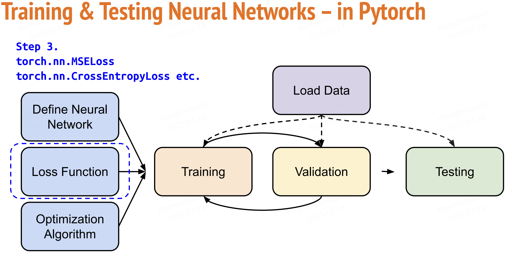
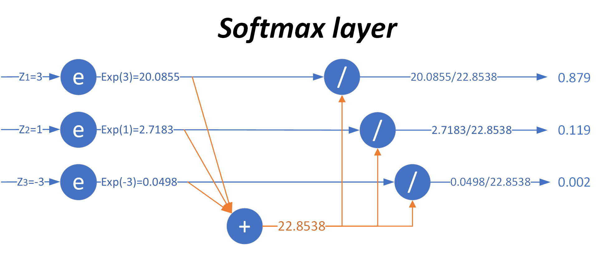
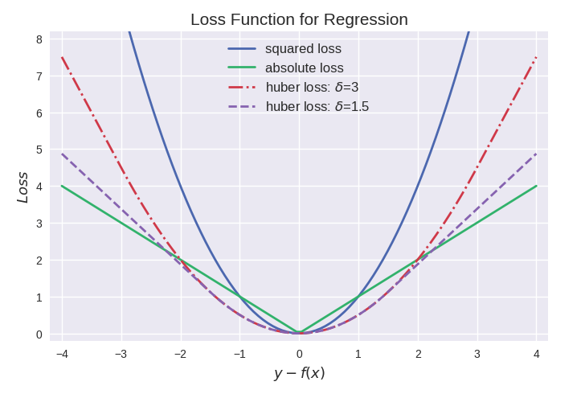

- [一，损失函数概述](#一损失函数概述)
- [二，交叉熵函数-分类损失](#二交叉熵函数-分类损失)
  - [2.1，交叉熵（Cross-Entropy）的由来](#21交叉熵cross-entropy的由来)
    - [2.1.1，熵、相对熵以及交叉熵总结](#211熵相对熵以及交叉熵总结)
  - [2.2，二分类问题的交叉熵](#22二分类问题的交叉熵)
  - [2.3，多分类问题的交叉熵](#23多分类问题的交叉熵)
  - [2.4，PyTorch 中的 Cross Entropy](#24pytorch-中的-cross-entropy)
    - [2.4.1，Softmax 多分类函数](#241softmax-多分类函数)
  - [2.5，为什么不能使用均方差做为分类问题的损失函数？](#25为什么不能使用均方差做为分类问题的损失函数)
- [三，回归损失](#三回归损失)
  - [3.1，MAE 损失](#31mae-损失)
  - [3.2，MSE 损失](#32mse-损失)
  - [3.3，`Huber` 损失](#33huber-损失)
  - [3.4，代码实现](#34代码实现)
- [参考资料](#参考资料)

## 一，损失函数概述

大多数深度学习算法都会涉及某种形式的优化，**所谓优化指的是改变 $x$ 以最小化或最大化某个函数 $f(x)$ 的任务**，我们通常以最小化 $f(x)$ 指代大多数最优化问题。

在机器学习中，损失函数是代价函数的一部分，而代价函数是目标函数的一种类型。
- **损失函数**（`loss function`）: 用于定义单个训练样本预测值与真实值之间的误差
- **代价函数**（`cost function`）: 用于定义单个批次/整个训练集样本预测值与真实值之间的累计误差。
- **目标函数**（`objective function`）: 泛指任意可以被优化的函数。

**损失函数定义**：损失函数是用来量化模型预测和真实标签之间差异的一个非负实数函数，其和优化算法紧密联系。深度学习算法优化的第一步便是确定损失函数形式。

损失函数大致可分为两种：回归损失（针对连续型变量）和分类损失（针对离散型变量），其在深度学习实验流程中的位置如下图所示。



> 图片来源李宏毅 2022 机器学习暑期课程-[Machine Learning Pytorch Tutorial](https://speech.ee.ntu.edu.tw/~hylee/ml/ml2022-course-data/Pytorch%20Tutorial%201.pdf)。

常用的减少损失函数的优化算法是“梯度下降法”（Gradient Descent）。

## 二，交叉熵函数-分类损失

交叉熵损失(`Cross-Entropy Loss`) 又称为对数似然损失(Log-likelihood Loss)、对数损失，二分类时还可称之为逻辑斯谛回归损失(Logistic Loss)。

### 2.1，交叉熵（Cross-Entropy）的由来
> 交叉熵损失的由来参考文档 [AI-EDU: 交叉熵损失函数](https://microsoft.github.io/ai-edu/%E5%9F%BA%E7%A1%80%E6%95%99%E7%A8%8B/)。

**1，信息量**

信息论中，信息量的表示方式：
> 《深度学习》（花书）中称为自信息(self-information) 。
> 在本文中，我们总是用 $\text{log}$ 来表示自然对数，**其底数**为 $e$。

$$
I(x_j) = -\log (p(x_j))
$$

- $x_j$：表示一个事件
- $p(x_j)$：表示事件 $x_j$ 发生的概率
- $I(x_j)$：信息量，$x_j$ 越不可能发生时，它一旦发生后的信息量就越大

**2，熵**

信息量只处理单个的输出。我们可以用熵（也称香农熵 `Shannon entropy`）来对整个概率分布中的不确定性总量进行量化:

$$
H(p) = - \sum_j^n p(x_j) \log (p(x_j))
$$

则上面的问题的熵是：
$$
\begin{aligned} H(p)&=-[p(x_1) \ln p(x_1) + p(x_2) \ln p(x_2) + p(x_3) \ln p(x_3)] \\\ &=0.7 \times 0.36 + 0.2 \times 1.61 + 0.1 \times 2.30 \\\ &=0.804 \end{aligned}
$$
**3，相对熵(KL散度)**

相对熵又称 `KL` 散度，如果对于同一个随机变量 $x$ 有两个单独的概率分布 $P(x)$ 和 $Q(x)$，则可以使用 KL 散度（Kullback-Leibler (KL) divergence）来**衡量这两个分布的差异**，这个相当于信息论范畴的均方差。

KL散度的计算公式：

$$
D_{KL}(p||q)=\sum_{j=1}^m p(x_j) \log {p(x_j) \over q(x_j)}
$$

$m$ 为事件的所有可能性（分类任务中对应类别数目）。**$D$ 的值越小，表示 $q$ 分布和 $p$ 分布越接近**。

**4，交叉熵**

把上述交叉熵公式变形：

$$
\begin{aligned} D_{KL}(p||q)&=\sum_{j=1}^m p(x_j) \log {p(x_j)} - \sum_{j=1}^m p(x_j) \log q(x_j) \\\ &=- H(p(x)) + H(p,q) \end{aligned}
$$

等式的前一部分恰巧就是 $p$ 的熵，等式的后一部分，就是**交叉熵**（机器学习中 $p$ 表示真实分布（目标分布），$q$ 表示预测分布）:

$$
H(p,q) =- \sum_{j=1}^m p(x_j) \log q(x_j)
$$

在机器学习中，我们需要评估**标签值 $y$ 和预测值 $a$** 之间的差距熵（即**两个概率分布之间的相似性**），使用 KL 散度 $D_{KL}(y||a)$ 即可，但因为样本标签值的分布通常是固定的，即 $H(a)$ 不变。因此，为了计算方便，在优化过程中，只需要关注交叉熵就可以了。所以，**在机器学习中一般直接用交叉熵做损失函数来评估模型**。

$$
loss = \sum_{j = 1}^{m}y_{j}\text{log}(a_{j})
$$

上式是单个样本的情况，$m$ **并不是样本个数，而是分类个数**。所以，对于**批量样本的交叉熵损失**计算公式（很重要!）是：

$$
J = -\frac{1}{n}\sum_{i=1}^n \sum_{j=1}^{m} y_{ij} \log a_{ij}
$$

其中，$n$ 是样本数，$m$ 是分类数。
> 公式参考文章-[AI-EDU: 交叉熵损失函数](https://microsoft.github.io/ai-edu/%E5%9F%BA%E7%A1%80%E6%95%99%E7%A8%8B/A2-%E7%A5%9E%E7%BB%8F%E7%BD%91%E7%BB%9C%E5%9F%BA%E6%9C%AC%E5%8E%9F%E7%90%86/%E7%AC%AC1%E6%AD%A5%20-%20%E5%9F%BA%E6%9C%AC%E7%9F%A5%E8%AF%86/03.2-%E4%BA%A4%E5%8F%89%E7%86%B5%E6%8D%9F%E5%A4%B1%E5%87%BD%E6%95%B0.html)，但是将样本数改为 $n$，类别数改为 $m$。

有一类特殊问题，就是事件只有两种情况发生的可能，比如“是狗”和“不是狗”，称为 $0/1$ 分类或**二分类**。对于这类问题，由于 $m=2，y_1=1-y_2，a_1=1-a_2$，所以**二分类问题的单个样本的交叉熵**可以简化为：

$$
loss =-[y \log a + (1-y) \log (1-a)]
$$

**二分类对于批量样本的交叉熵**计算公式是：

$$
J= -\frac{1}{n} \sum_{i=1}^n [y_i \log a_i + (1-y_i) \log (1-a_i)]
$$
> 为什么交叉熵的代价函数是求均值而不是求和?
>  Cross entropy loss is defined as the “expectation” of the probability distribution of a random variable 𝑋, and that’s why we use mean instead of sum. 参见[这里](https://d2l.ai/chapter_appendix-mathematics-for-deep-learning/information-theory.html#cross-entropy)。

#### 2.1.1，熵、相对熵以及交叉熵总结

> 交叉熵 $H(p, q)$ 也记作 $CE(p, q)$、$H(P, Q)$，其另一种表达公式（公式表达形式虽然不一样，但是意义相同）:
> $$H(P, Q)  = -\mathbb{E}_{\textrm{x}\sim p}log(q(x))$$

交叉熵函数常用于逻辑回归(`logistic regression`)，也就是分类(`classification`)。

根据信息论中熵的性质，将熵、相对熵（KL 散度）以及交叉熵的公式放到一起总结如下:

$$\begin{aligned}
H(p) &= -\sum_{j}p(x_j) \log p(x_j) \\
D_{KL}(p \parallel q) &= \sum_{j}p(x_j)\log \frac{p(x_j)}{q(x_j)} = \sum_j (p(x_j)\log p(x_j) - p(x_j) \log q(x_j)) \\
H(p,q) &=  -\sum_j p(x_j)\log q(x_j) \\
\end{aligned} $$

### 2.2，二分类问题的交叉熵

把二分类的交叉熵公式 4 分解开两种情况：
- 当 $y=1$ 时，即标签值是 $1$ ，是个正例，加号后面的项为: $loss = -\log(a)$
- 当 $y=0$ 时，即标签值是 $0$，是个反例，加号前面的项为 $0$: $loss = -\log (1-a)$

横坐标是预测输出，纵坐标是损失函数值。$y=1$ 意味着当前样本标签值是1，当预测输出越接近1时，损失函数值越小，训练结果越准确。当预测输出越接近0时，损失函数值越大，训练结果越糟糕。此时，损失函数值如下图所示。


### 2.3，多分类问题的交叉熵

当标签值不是非0即1的情况时，就是多分类了。

假设希望根据图片动物的轮廓、颜色等特征，来预测动物的类别，有三种可预测类别：猫、狗、猪。假设我们训练了两个分类模型，其预测结果如下:

**模型1**:

|预测值|标签值|是否正确|
|-----|-----|-------|
|0.3 0.3 0.4|0 0 1（猪）|正确|
|0.3 0.4 0.4|0 1 0（狗）|正确|
|0.1 0.2 0.7|1 0 0（猫）|错误|

每行表示不同样本的预测情况，公共 3 个样本。可以看出，模型 1 对于样本 1 和样本 2 以非常微弱的优势判断正确，对于样本 3 的判断则彻底错误。

**模型2**:

|预测值|标签值|是否正确|
|-----|-----|-------|
|0.1 0.2 0.7|0 0 1（猪）|正确|
|0.1 0.7 0.2|0 1 0（狗）|正确|
|0.3 0.4 0.4|1 0 0（猫）|错误|

可以看出，模型 2 对于样本 1 和样本 2 判断非常准确（预测概率值更趋近于 1），对于样本 3 虽然判断错误，但是相对来说没有错得太离谱（预测概率值远小于 1）。

结合多分类的交叉熵损失函数公式可得，模型 1 的交叉熵为:

$$\begin{aligned} 
\text{sample}\ 1\ \text{loss} = -(0\times log(0.3) + 0\times log(0.3) + 1\times log(0.4) = 0.91 \\
\text{sample}\ 1\ \text{loss} = -(0\times log(0.3) + 1\times log(0.4) + 0\times log(0.4) = 0.91 \\
\text{sample}\ 1\ \text{loss} = -(1\times log(0.1) + 0\times log(0.2) + 0\times log(0.7) = 2.30
\end{aligned}$$

对所有样本的 `loss` 求平均:

$$
L = \frac{0.91 + 0.91 + 2.3}{3} = 1.37
$$

模型 2 的交叉熵为:

$$\begin{aligned} 
\text{sample}\ 1\ \text{loss} = -(0\times log(0.1) + 0\times log(0.2) + 1\times log(0.7) = 0.35 \\
\text{sample}\ 1\ \text{loss} = -(0\times log(0.1) + 1\times log(0.7) + 0\times log(0.2) = 0.35 \\
\text{sample}\ 1\ \text{loss} = -(1\times log(0.3) + 0\times log(0.4) + 0\times log(0.4) = 1.20
\end{aligned} $$

对所有样本的 `loss` 求平均:

$$
L = \frac{0.35 + 0.35 + 1.2}{3} = 0.63
$$

可以看到，0.63 比 1.37 的损失值小很多，这说明预测值越接近真实标签值，即交叉熵损失函数可以较好的捕捉到模型 1 和模型 2 预测效果的差异。**交叉熵损失函数值越小，反向传播的力度越小**。
> 多分类问题计算交叉熵的实例来源于知乎文章-[损失函数｜交叉熵损失函数](https://zhuanlan.zhihu.com/p/35709485)。

### 2.4，PyTorch 中的 Cross Entropy

PyTorch 中常用的交叉熵损失函数为 `torch.nn.CrossEntropyLoss`

```python
class torch.nn.CrossEntropyLoss(weight=None, size_average=None,
                                ignore_index=-100, reduce=None, 
                                reduction='elementwise_mean')
```

**1，函数功能**:

将输入经过 `softmax` 激活函数之后，再计算其与 `target` 的交叉熵损失。即该方法将 `nn.LogSoftmax()` 和 `nn.NLLLoss()`进行了结合。严格意义上的交叉熵损失函数应该是 `nn.NLLLoss()`。

**2，参数解释**:

- `weight`(Tensor)- 为每个类别的 loss 设置权值，常用于类别不均衡问题。weight 必须是 float 类型的 tensor，其长度要于类别 `C` 一致，即每一个类别都要设置有 weight。
- `size_average`(bool)- 当 reduce=True 时有效。为 True 时，返回的 loss 为平均值;为 False 时，返回的各样本的 loss 之和。
- `reduce`(bool)- 返回值是否为标量，默认为 True。
- `ignore_index`(int)- 忽略某一类别，不计算其 `loss`，其 loss 会为 0，并且，在采用 size_average 时，不会计算那一类的 loss，除的时候的分母也不会统计那一类的样本。

#### 2.4.1，Softmax 多分类函数
> 注意: Softmax 用作模型最后一层的函数通常和交叉熵作损失函数配套搭配使用，应用于多分类任务。

对于二分类问题，我们使用 `Logistic` 函数计算样本的概率值，从而把样本分成了正负两类。对于多分类问题，则使用 `Softmax` 作为模型最后一层的激活函数来将**多分类的输出值转换为范围在 [0, 1] 和为 1 的概率分布**。

Softmax 从字面上来说，可以分成 soft 和 max 两个部分。max 故名思议就是最大值的意思。Softmax 的核心在于 soft，而 soft 有软的含义，与之相对的是 hard 硬，即 herdmax。下面分布演示将模型输出值**取 max 值**和**引入 Softmax** 的对比情况。

**取max值（hardmax）**

假设模型输出结果 $z$ 值是 $[3,1,-3]$，如果取 max 操作会变成 $[1, 0, 0]$，这符合我们的分类需要，即三者相加为1，并且认为该样本属于第一类。但是有两个不足：

1. 分类结果是 $[1,0,0]$，只保留非 0 即 1 的信息，即非黑即白，没有各元素之间相差多少的信息，可以理解是“Hard Max”；
2. max 操作本身不可导，无法用在反向传播中。

**引入Softmax**

`Softmax` 加了个"soft"来模拟 max 的行为，但同时又保留了相对大小的信息。

$$
a_j = \text{Softmax}(z_j) = \frac{e^{z_j}}{\sum\limits_{i=1}^m e^{z_i}}=\frac{e^{z_j}}{e^{z_1}+e^{z_2}+\dots+e^{z_m}}
$$

上式中:

- $z_j$ 是对第 $j$ 项的分类原始值，即矩阵运算的结果
- $z_i$ 是参与分类计算的每个类别的原始值
- $m$ 是总分类数
- $a_j$ 是对第 $j$ 项的计算结果

和 hardmax 相比，Softmax 的含义就在于不再唯一的确定某一个最大值，而是为每个输出分类的结果都赋予一个概率值（置信度），表示属于每个类别的可能性。

下图可以形象地说明 Softmax 的计算过程。



当输入的数据 $[z_1,z_2,z_3]$ 是 $[3, 1, -3]$ 时，按照图示过程进行计算，可以得出输出的概率分布是 $[0.879,0.119,0.002]$。对比 max 运算和 Softmax 的不同，如下表所示。

|输入原始值|MAX计算|Softmax计算|
|--------|-------|----------|
|$[3, 1, -3]$|$[1, 0, 0]$|$[0.879, 0.119, 0.002]$|

可以看出 Softmax 运算结果两个特点：

1. 三个类别的概率相加为 1
2. 每个类别的概率都大于 0

下面我再给出 hardmax 和 softmax 计算的代码实现。

```python
# example of the argmax of a list of numbers
from numpy import argmax
from numpy import exp

# define data
data = [3, 1, -3]

def hardmax(data):
    """# calculate the argmax of the list"""
    result = argmax(data) 
    return result

def softmax(vector):
    """# calculate the softmax of a vector"""
    e = exp(vector)
    return e / e.sum()

hardmax_result = hardmax(data)
# 运行该示例返回列表索引值“0”，该值指向包含列表“3”中最大值的数组索引 [1]。
print(hardmax(data)) # 0

# convert list of numbers to a list of probabilities
softmax_result = softmax(data) 
print(softmax_result) # report the probabilities
print(sum(softmax_result)) # report the sum of the probabilitie
```

运行以上代码后，输出结果如下:
> 0
[0.87887824 0.11894324 0.00217852]
1.0

很明显程序的输出结果和我们手动计算的结果是一样的。

Pytorch 中的 Softmax 函数定义如下:

```python
def softmax(x):
    return torch.exp(x)/torch.sum(torch.exp(x), dim=1).view(-1,1)
```

`dim=1` 用于 `torch.sum()` 对所有列的每一行求和，`.view(-1,1)` 用于防止广播。

### 2.5，为什么不能使用均方差做为分类问题的损失函数？

回归问题通常用均方差损失函数，可以保证损失函数是个凸函数，即可以得到最优解。而分类问题如果用均方差的话，损失函数的表现不是凸函数，就很难得到最优解。而交叉熵函数可以保证区间内单调。

分类问题的最后一层网络，需要分类函数，`Sigmoid` 或者 `Softmax`，如果再接均方差函数的话，其求导结果复杂，运算量比较大。用交叉熵函数的话，可以得到比较简单的计算结果，一个简单的减法就可以得到反向误差。

## 三，回归损失

与分类问题不同，回归问题解决的是**对具体数值的预测**。解决回归问题的神经网络一般只有只有一个输出节点，这个节点的输出值就是预测值。

回归问题的一个基本概念是**残差**或称为**预测误差**，用于衡量模型预测值与真实标记的靠近程度。假设回归问题中对应于第 $i$ 个输入特征 $x_i$ 的**标签**为 $y^i = (y_1,y_2,...,y_M)^{\top}$，$M$ 为标记向量总维度，则 $l_{t}^{i}$ 即表示样本 $i$ 上神经网络的回归预测值 ($y^i$) 与其样本标签值在第 $t$ 维的预测误差(亦称残差):

$$
l_{t}^{i} = y_{t}^{i} - \hat{y}_{t}^{i}
$$

常用的两种损失函数为 $\text{MAE}$（也叫 `L1` 损失） 和 $\text{MSE}$ 损失函数（也叫 `L2` 损失）。


### 3.1，MAE 损失

平均绝对误差（Mean Absolute Error，`MAE`）是用于回归模型的最简单但最强大的损失函数之一。

因为存在离群值（与其余数据差异很大的值），所以回归问题可能具有本质上不是严格高斯分布的变量。 在这种情况下，平均绝对误差将是一个理想的选择，因为它没有考虑异常值的方向（不切实际的高正值或负值）。

顾名思义，MAE 是**目标值和预测值之差的绝对值之和**。$n$ 是数据集中数据点的总数，其公式如下:
$$
\text{MAE loss} = \frac{1}{n}\sum_{i=1}^{N}\sum_{t=1}^{M} |y_{t}^{i} - \hat{y}_{t}^{i}|
$$

### 3.2，MSE 损失

均方误差（Mean Square Error, `MSE`）几乎是每个数据科学家在回归损失函数方面的偏好，这是因为**大多数变量都可以建模为高斯分布**。

均方误差计算方法是求**预测值与真实值之间距离的平方和**。预测值和真实值越接近，两者的均方差就越小。公式如下:

$$
\text{MSE loss} = \frac{1}{n}\sum_{i=1}^{N}\sum_{t=1}^{M} (y_{t}^{i} - \hat{y}_{t}^{i})^2
$$

### 3.3，`Huber` 损失

MAE 和 MSE 损失之间的比较产生以下结果：

1. **MAE 损失比 MSE 损失更稳健**。仔细查看公式，可以观察到如果预测值和实际值之间的差异很大，与 MAE 相比，MSE 损失会放大效果。 由于 MSE 会屈服于异常值，因此 MAE 损失函数是更稳健的损失函数。

2. **MAE 损失不如 MSE 损失稳定**。由于 MAE 损失处理的是距离差异，因此一个小的水平变化都可能导致回归线波动很大。在多次迭代中发生的影响将导致迭代之间的斜率发生显著变化。总结就是，MSE 可以确保回归线轻微移动以对数据点进行小幅调整。
3. **MAE 损失更新的梯度始终相同**。即使对于很小的损失值，梯度也很大。这样不利于模型的学习。为了解决这个缺陷，我们可以使用变化的学习率，在损失接近最小值时降低学习率。
4. **MSE 损失的梯度随损失增大而增大，而损失趋于0时则会减小**。其使用固定的学习率也可以有效收敛。

Huber Loss 结合了 MAE 的稳健性和 MSE 的稳定性，本质上是 MAE 和 MSE 损失中最好的。**对于大误差，它是线性的，对于小误差，它本质上是二次的**。

Huber Loss 的特征在于参数 $\delta$。当 $|y − \hat{y}|$ 小于一个事先指定的值 $\delta $ 时，变为平方损失，大于 $\delta $ 时，则变成类似于绝对值损失，因此其是比较robust 的损失函数。其定义如下:

$$\text{Huber loss} = \left \lbrace \begin{matrix}
\frac12[y_{t}^{i} - \hat{y}_{t}^{i}]^2 & |y_{t}^{i} - \hat{y}_{t}^{i}| \leq \delta \\ 
\delta|y_{t}^{i} - \hat{y}_{t}^{i}| - \frac12\delta^2 & |y_{t}^{i} - \hat{y}_{t}^{i})| > \delta
\end{matrix}\right.$$

三种回归损失函数的曲线图比较如下：


> 代码来源 [Loss Function Plot.ipynb](https://nbviewer.org/github/massquantity/Loss-Functions/blob/master/Loss%20Function%20Plot.ipynb)。

三种回归损失函数的其他形式定义如下:


### 3.4，代码实现

下面是三种回归损失函数的 python 代码实现，以及对应的 `sklearn` 库的内置函数。

```python
# true: Array of true target variable
# pred: Array of predictions
def mse(true, pred):
    return np.sum((true - pred)**2)

def mae(true, pred):
    return np.sum(np.abs(true - pred))

def huber(true, pred, delta):
    loss = np.where(np.abs(true-pred) < delta , 0.5*((true-pred)**2),delta*np.abs(true - pred) - 0.5*(delta**2))

    return np.sum(loss)

# also available in sklearn
from sklearn.metrics import mean_squared_error
from sklearn.metrics import mean_absolute_error
```

## 参考资料

1. [《动手学深度学习-22.11. Information Theory》](https://d2l.ai/chapter_appendix-mathematics-for-deep-learning/information-theory.html#cross-entropy)
2. [损失函数｜交叉熵损失函数](https://zhuanlan.zhihu.com/p/35709485)
3. [AI-EDU: 交叉熵损失函数](https://microsoft.github.io/ai-edu/%E5%9F%BA%E7%A1%80%E6%95%99%E7%A8%8B/A2-%E7%A5%9E%E7%BB%8F%E7%BD%91%E7%BB%9C%E5%9F%BA%E6%9C%AC%E5%8E%9F%E7%90%86/%E7%AC%AC1%E6%AD%A5%20-%20%E5%9F%BA%E6%9C%AC%E7%9F%A5%E8%AF%86/03.2-%E4%BA%A4%E5%8F%89%E7%86%B5%E6%8D%9F%E5%A4%B1%E5%87%BD%E6%95%B0.html)
4. [常见回归和分类损失函数比较](https://www.cnblogs.com/massquantity/p/8964029.html)
5. 《PyTorch_tutorial_0.0.5_余霆嵩》
6. https://pytorch.org/docs/stable/generated/torch.nn.CrossEntropyLoss.html
7. [一文详解Softmax函数](https://zhuanlan.zhihu.com/p/105722023)
8. [AI-EDU: 多分类函数](https://microsoft.github.io/ai-edu/%E5%9F%BA%E7%A1%80%E6%95%99%E7%A8%8B/A2-%E7%A5%9E%E7%BB%8F%E7%BD%91%E7%BB%9C%E5%9F%BA%E6%9C%AC%E5%8E%9F%E7%90%86/en-us/Step3%20-%20LinearClassification/07.1-%E5%A4%9A%E5%88%86%E7%B1%BB%E5%87%BD%E6%95%B0.html#711-softmax)
